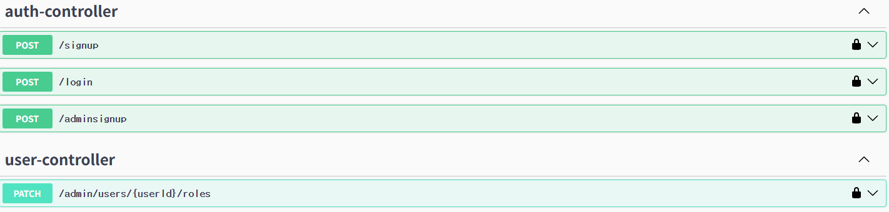
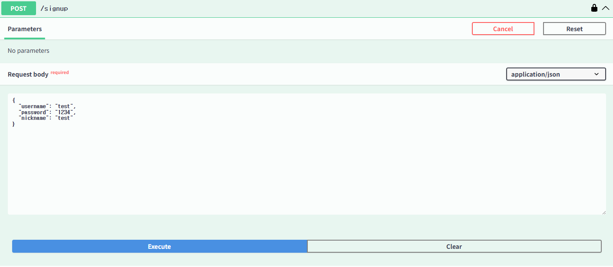
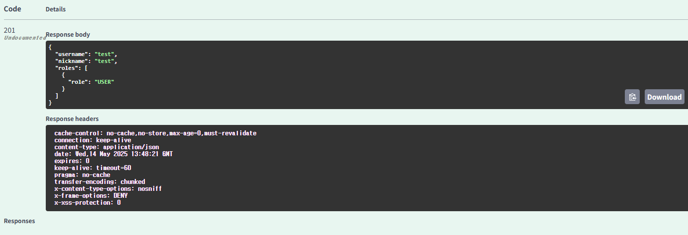
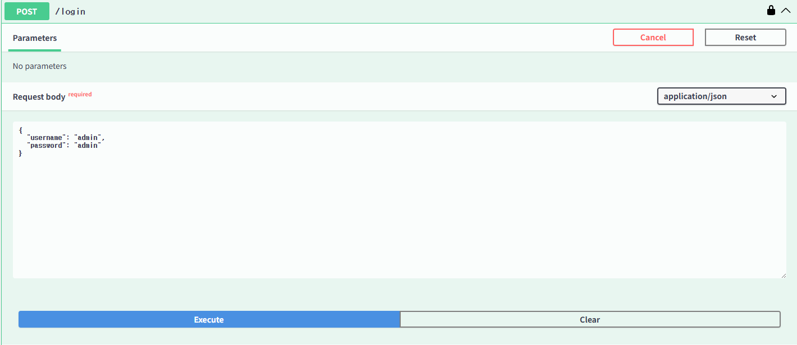
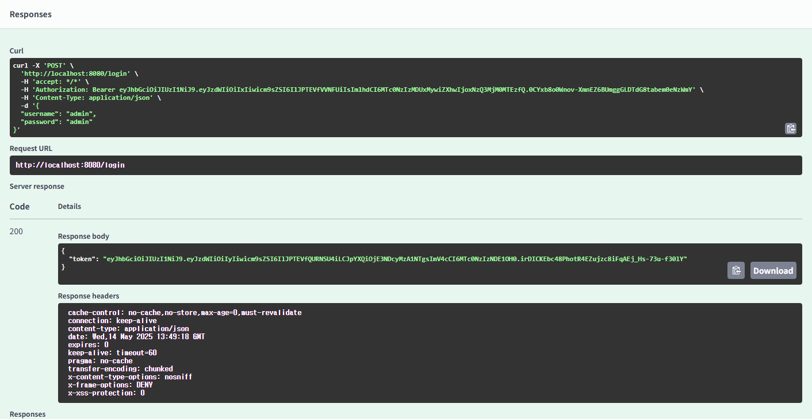
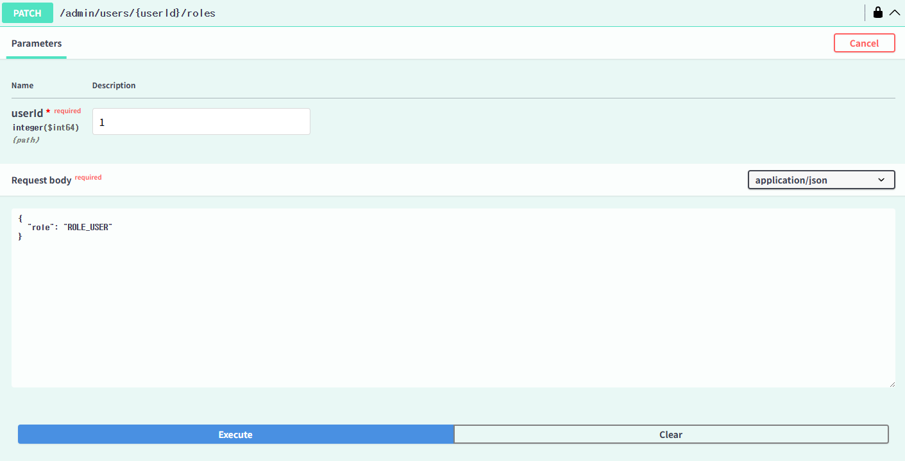
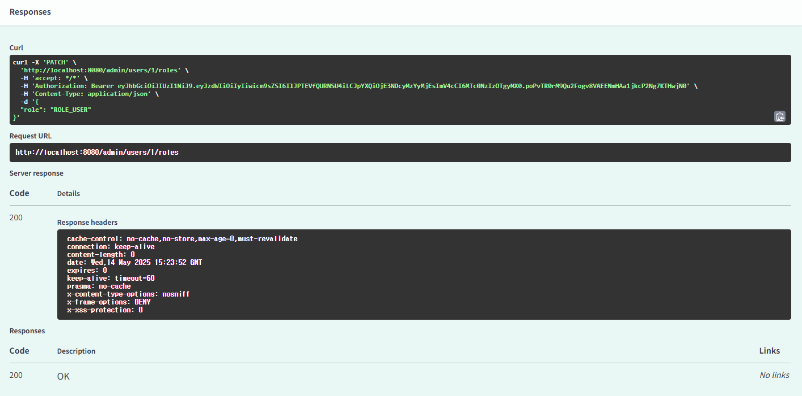

# SmartWardrobe

간단한 의류 관리 서비스 프로젝트입니다.

현재는 회원가입·로그인, JWT 기반 인증·인가, 관리자 권한 관리 API와 Swagger 문서화를 구현했습니다.

## 주요 기능
- **회원가입**
    - 일반 사용자(ROLE_USER) 및 관리자(ROLE_ADMIN) 가입
- **로그인**
    - JWT 발급
- **관리자 권한 부여**
    - Admin API로 다른 사용자에게 ADMIN 권한 부여
- **인증·인가**
    - 모든 보호된 API는 `Authorization: Bearer <JWT>` 헤더 필요
    - 토큰 검증, 만료, 권한 검사
- **Swagger UI**
    - `/swagger-ui.html` 에서 바로 API 문서 확인 및 테스트

---
## 기술 스택

### Backend
<!-- Java -->

<!-- Spring Boot -->

<!-- Gradle -->

### DB
<!-- H2 Database -->

### Security
<!-- Spring Security -->

<!-- JWT (JJWT) -->

### API 문서화
<!-- Swagger UI -->

---

## API 명세

### 1. Auth API

| 기능               | Method | URL                  | Request Header                         | Request Body      | Response Body      | Response Status                                    |
|------------------|:------:|---------------------|----------------------------------------|------------------|--------------------|-----------------------------------------------------|
| 회원 가입          | POST   | `/signup`           | -                                      | `SignUpRequest`  | `SignUpResponse`   | `201 Created` `400 Bad Request`                  |
| 관리자 회원 가입     | POST   | `/adminsignup`      | `Authorization: Bearer <token>`        | `SignUpRequest`  | `SignUpResponse`   | `201 Created` `400 Bad Request` `401 Unauthorized` `403 Forbidden` |
| 로그인             | POST   | `/login`            | -                                      | `LoginRequest`   | `TokenResponse`    | `200 OK` `400 Bad Request`                       |

### 2. Admin API

| 기능                                        | Method | URL                           | Request Header                  | Request Body        | Response Body        | Response Status                                                                                    |
| ----------------------------------------- | :----: | ----------------------------- | ------------------------------- | ------------------- | -------------------- | -------------------------------------------------------------------------------------------------- |
| 권한 변경|  PATCH | `/admin/users/{userId}/roles` | `Authorization: Bearer <token>` | `RoleChangeRequest` | `RoleChangeResponse` | `200 OK` `400 Bad Request` (잘못된 입력) `401 Unauthorized` `403 Forbidden` `404 Not Found` |

## Swagger
접속 방법 : http://localhost:8080/swagger-ui/index.html#/

### Auth
#### signup

#### signin

### User

